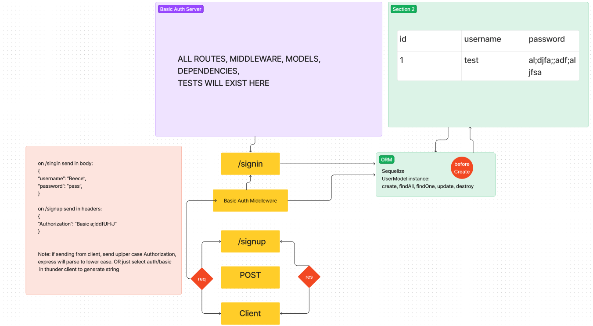

# LAB - Class 06

Project: Basic Auth

Author: Reece Renninger

Problem Domain

Creating a Basic Auth server with 2 routes to allow users to sign up and sign in.

Links and Resources

  [GitHub Actions ci/cd](https://github.com/ReeceRenninger/basic-auth/issues)
    back-end server url (when applicable)
   
Collaborators

- Stephen, Keelen, and Ryan G all tried helping me with getting my server route to connect with my DB

Setup
PORT = <dev choice>
DATABASE_URL = <postgres-databaseUrl-template>

How to initialize/run your application (where applicable)

    e.g. npm start

How to use your library (where applicable)
Features / Routes

    Feature One: Details of feature
    GET : /hello - specific route to hit

Tests

    How do you run tests?
    Any tests of note?
    Describe any tests that you did not complete, skipped, etc

UML

